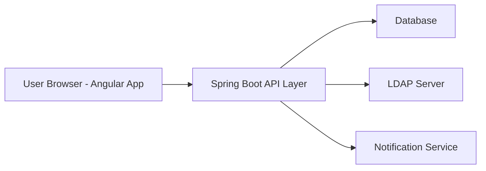
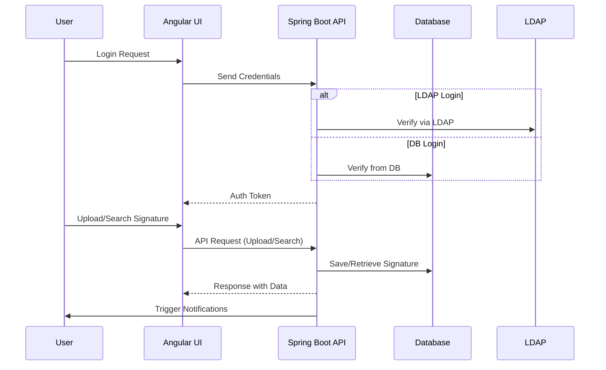
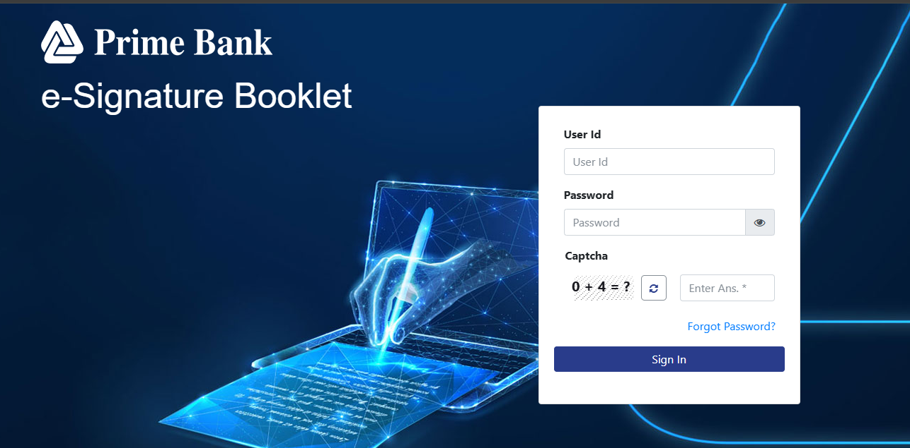

# e-Signature Management System

A secure, permission-based e-Signature application built using **Angular** (frontend) and **Spring Boot** (backend) for managing bank **PA Holder** signatures.  
This system allows storage, search, and verification of signatures with multi-source authentication and notification features.

---

## Features

### 1. Signature Management
- Store and manage **PA Holder** signatures digitally.  
- Search and retrieve signatures instantly.  
- Signature preview and verification.

### 2. Role-Based Access Control
- **Permission-based user management**: Admin, Manager, and Standard User roles.  
- Fine-grained access to features and operations.

### 3. Notifications
- Trigger notifications to relevant users based on **business logic** at different events (e.g., signature updates, approvals).  

### 4. Authentication
- Supports both:
  - **LDAP-based login** (corporate users).
  - **Database-based login** (application-managed users).

### 5. Tech Stack
- **Frontend**: Angular (SPA, responsive UI)
- **Backend**: Spring Boot (REST API)
- **Database**: Relational DB (PostgreSQL/MySQL)
- **Authentication**: LDAP + JWT
- **Deployment**: Docker / On-premise server support

---

## Architecture Diagram



---

## Workflow Diagram



---

## Installation & Setup

### Prerequisites
- **Node.js** (v16+) & Angular CLI  
- **Java 17+** & Maven  
- **Database** (PostgreSQL/MySQL)  
- **LDAP server** (optional, if using LDAP login)

--- 

### 4. Authentication
- Supports both:
  - **LDAP-based login** (corporate users).
  - **Database-based login** (application-managed users).

### 5. Tech Stack
- **Frontend**: Angular (SPA, responsive UI)
- **Backend**: Spring Boot (REST API)
- **Database**: ORACLE 19c
- **Authentication**: LDAP + JWT
- **Deployment**: Docker / On-premise server support

---

## Architecture Overview

```text
[Angular UI]  <-->  [Spring Boot API Layer]  <-->  [Database + LDAP]
```

- **Angular**: Handles user interface, form submissions, and role-based view rendering.  
- **Spring Boot**: Manages APIs, business logic, authentication, and notification services.  
- **Database & LDAP**: Signature storage and corporate user authentication.

---

## Installation & Setup

### Prerequisites
- **Node.js** (v16+) & Angular CLI  
- **Java 17+** & Maven  
- **Database** ORACLE 19c  
- **LDAP server** (optional, if using LDAP login)

---

### Backend (Spring Boot)
```bash
# Clone repository
git clone https://github.com/ma-muktadeer/e-signature.git
cd server/esignature-server

# Configure application.properties
# - Database credentials
# - LDAP settings
# - JWT secret keys

# Build and run
mvn clean install
java -jar target/e-signature-app.jar
```

---

### Frontend (Angular)
```bash
# Navigate to frontend
cd ui/esignature

# Install dependencies
npm install

# Run the application
ng serve
```

Open browser at: `http://localhost:4200`

---

## Configuration

- **Role Permissions**: Defined in backend (Spring Security config).  
- **Notification Logic**: Customizable per event in business layer.  
- **LDAP/DB Toggle**: Switch authentication mode via `application.yml` property.

---

## Screenshots 

### 1. Login Page

| **1** |
|-------|
|  |


---

## Future Enhancements
- Digital signature verification (PKI).  
- Audit trail and detailed activity logs.  
- Multi-language UI support.

---

## License

This project is proprietary and intended for internal banking use only.
